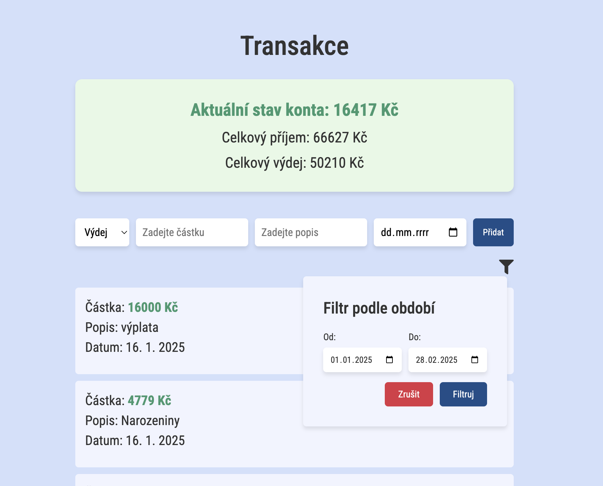

# Cashflow tracker 📊
## Popis
Aplikace umožňuje zaznamenávání příjmů a výdajů, jejich filtrování, editaci, odstranění a další funkce. Data jsou uložena a spravována prostřednictvím databáze Firebase. 

**Live Demo:** 
https://expense-log-app.netlify.app

## To Do
- [ ] Přidat graf pro vizualizaci příjmů a výdajů
- [ ] Přidat autentifikaci
- [ ] Export dat do formátu CSV nebo PDF

## Spuštění projektu
Pro spuštění této React aplikace je potřeba mít nainstalovaný Git a Node.js (včetně npm). Postupujte následovně:
```bash
# Naklonujte tento repozitář
https://github.com/SedlakovaLucie/cashflow-tracker.git

# Vstupte do vytvořené složky
cd cashflow-tracker

# Nainstalujte
npm install

# Spusťte aplikaci
npm start
```
## Screenshot

